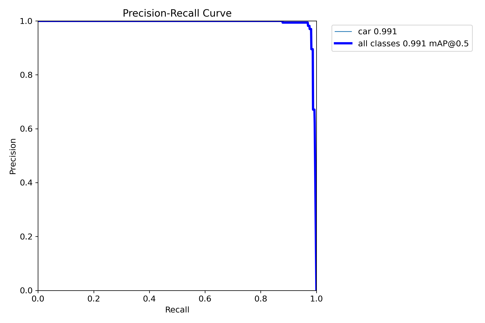
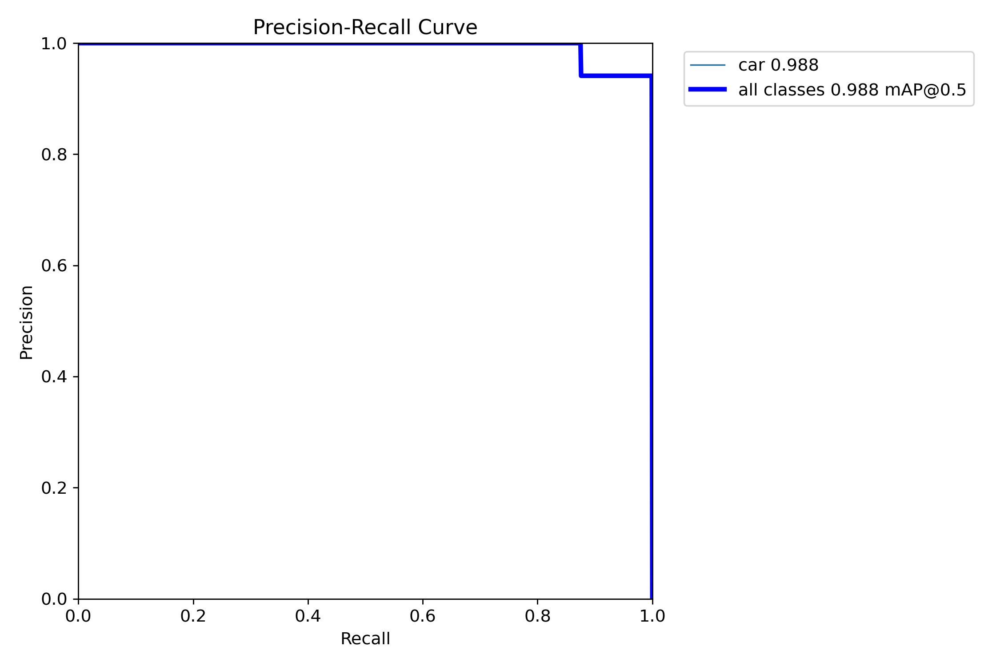
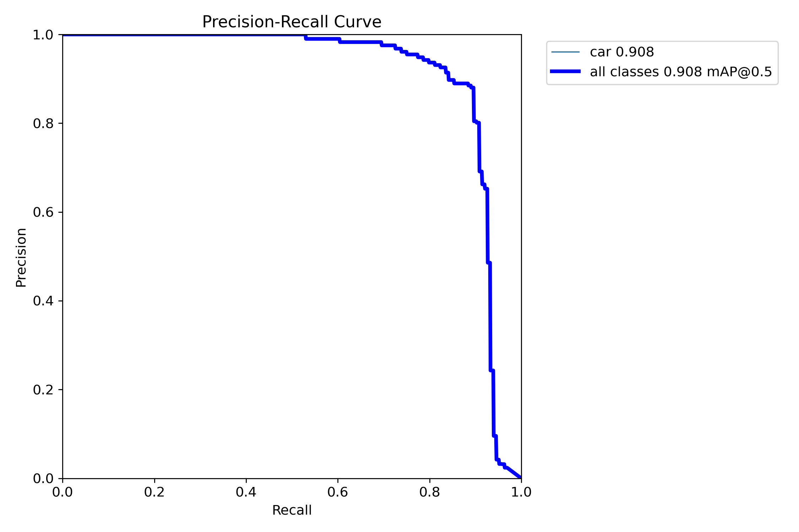
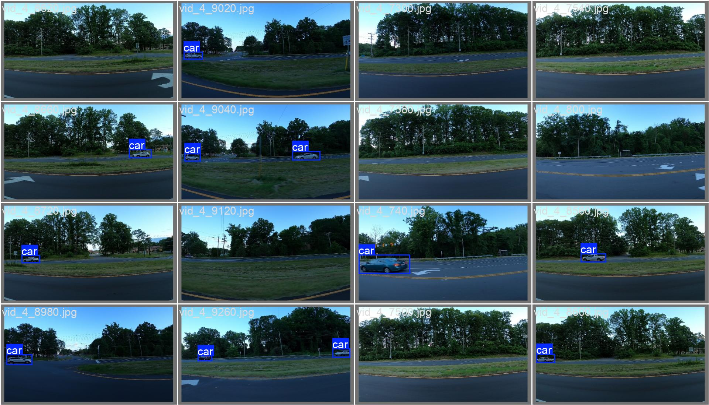
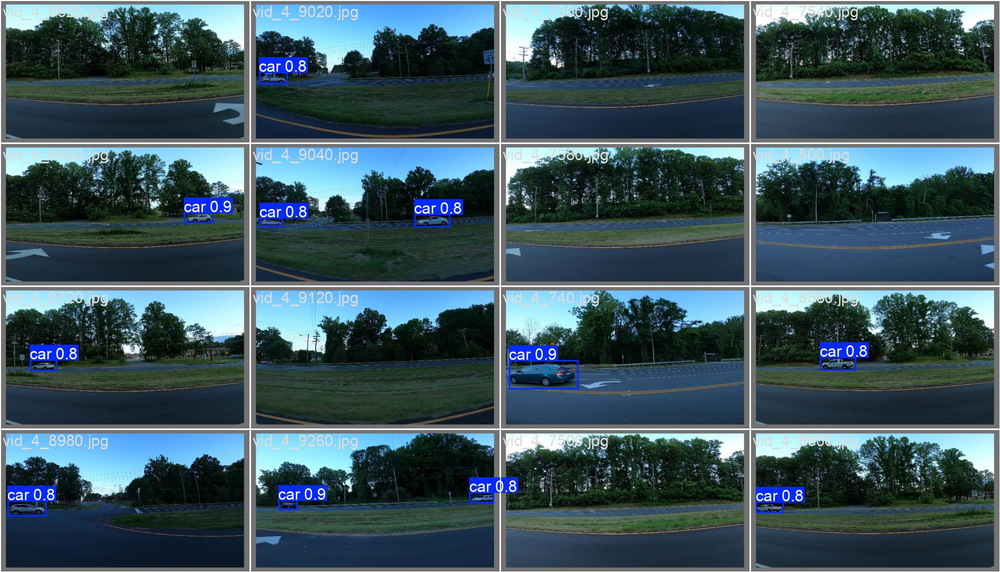

# Детектор автомобилей

## Общее описание

Выполнение тестового задания компании "Комплексные системы"

Приложение представляет собой веб сервис на FastAPI, содержащий html-форму для загрузки изображений и демонстрации результатов детекции автомобилей на них.

Приложение работает в Docker контейнере

Модель для обнаружения объектов реализована через дообучение модели YOLO.

Устройство работы модели, IP и порт приложения FastAPI и Docker контейнера задаются через переменные окружения ```APP_DEVICE```, ```APP_IP```, ```APP_PORT```, ```DOCKER_IP``` и ```DOCKER_PORT``` соответсвенно. Изначально переменные заданы в файле ```.env```

## Запуск

Чтобы построить контейнер и запустить приложение необходимо выполнить команду ```make up```

После построения и запуска конетейнера приложение будет запущено и доступно. По указанному адерсу можно будет видет форму для загрузки изображений

## Использование

Нажмите кнопку "Обзор", выберите любое количество изображений форматов ".jpg" или ".png" и намите кнопку "Найти автомобили". Приложение выведет на тойже странице изображения с ограничивающими прямоугольниками их строки с их координатами в формате xyxy.

## Обучение

Обучение проводилось в среде Google Collab. Блокнот ```train_cars.ipynb``` представлен в репозитории

## Точность

### Валидация

После обучении была построена PR кривая и расчитана метрика mAP50-95, составившая 0.705 на валидационной выборке.



### Тест

После обучении была построена PR кривая и расчитана метрика mAP50-95, составившая 0.725 на валидационной выборке.



### Предобученная модель

Для сравнения была проведена валидация предобученной модели на валижационной выборке. Была построена PR кривая и расчитана метрика mAP50-95, составившая 0.32.



Как видно, дообучение модели на предоставленной выборке ощутимо улучшило предсказания, увеличив более чем в два раза метрику mAP50-90. Это связанно в том числе с тем, что предобученная модель имеет больше классов предсказания и некоторые автомобили машина принимала за грузовики.

### Пример работы

Пример детекции изображений на валидациционной выборке в сравнении с разметкой.

 <div class="row">
  <div class="column">
    
  </div>
  <div class="column">
    
  </div>
 </div> 